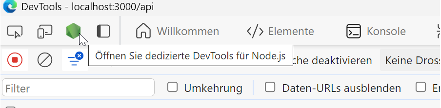

[General Readme](./README.md)

# Installation and Debugging

## Prerequisites

You need `node.js` v16 or higher installed on your machine.
For example, you can run following [guide](https://learn.microsoft.com/de-de/windows/dev-environment/javascript/nodejs-on-windows) for windows.
You also need `pnpm` as package manager. Check the [installation guide](https://pnpm.io/installation).
You need a database connection, as described in the section after next.
If you want to use docker to run this project, you need an installed and _running_ docker service. More Information can be found [some sections below](#docker).

## Configuration

The project uses the `.env`, respectively the `env.dev` file for configuring your instance. For local development, use the `env.dev` (added to `.gitignore` by default), which overwrites the default config params.

Additional you need to create a `topic.json` file to set your specific topic data. Have a look at `topic-example.json` for an example.
The topic.json is added to the `.gitignore` to save your personal data conventions.

## Database

You need an accessible database connection for querying the testdata. For the first version, a Postgres (v15) database with PostGIS extension is used. Sample data is stored in the `sql\data` dump and must be imported into your local database for testing.  
The database itself can be set up by three different approaches:

- Set up a database by your own. Follow one of Step-By-Step tutorials for the initial configuration.
  - Please ensure that the database is accessible by your host. Do not forget to add needed params to the `postgresql.conf` and `pg_hba.conf`
  - Do also not forget to install the PostGIS extension:
    ```
    create extension postgis;
    ```
    And if you have problems with missing type 'raster':
    ```
    create extension postgis_raster;
    ```
  - Use psql, pg_restore, pgadmin or any other PostgreSQL client for importing the testdata dump.
- You can also check the [installation guide](/documentation/postgresql-without-install.md) for setting up a PostgreSQL instance for missing administrator rights. The guide provides an easy step-by-step instructions for setting up the needed environment.
- Use the provided docker environment, which will create the needed database + extension + testdata automatically.

### Add new database support

If you want to support another database, read more in [Database support](/documentation/database-support.md)

## Installation

Run the following in your shell. The command will download and install all needed dependencies and packages.

```bash
$ pnpm install
```

## Running the app

Run one of the following command to start the service. The current scripts and params are defined in the `package.json` file.

Compile and run the service:

```bash
$ pnpm run start
```

Start the service in `watch mode` (more information [here](https://docs.nestjs.com/cli/usages#nest-start)), which adds live-reload and debugging functionalities. For more information about debugging check the corresponding section.

```bash
$ pnpm run start:dev
```

Compile the service for production usage. This does NOT start the actual service.

```bash
$ pnpm run start:prod
```

## Browser

Navigate to [http://localhost:3000/api](localhost:3000/api) to check out the SwaggerUI OpenAPI documentation.

Navigate to [http://localhost:3000/api-json](localhost:3000/api-json) to check out the SwaggerUI OpenAPI documentation in json formate.

## Test

```bash
# unit tests
$ pnpm run test

# e2e tests
$ pnpm run test:e2e

# test coverage
$ pnpm run test:cov
```

## Docker

It is possible to run and develop this project with Docker. The docker file will create an instance of the analysis-interface,
a postgres database with postgis and some example data will be available. To comfortably check the database state, pgAdmin4 is included.

### Docker Prerequisite

You need an installed and _running_ docker service. For example [Docker Desktop Windows](https://docs.docker.com/desktop/install/windows-install/).

You need to update following lines in your `.env` or `.env.dev` file:

```bash
db_postgres_host: db
db_postgres_password: geobakery
```

This will asure that the database is taken from the docker network and not from your computer. By default, the name of the service becomes the hostname/address of the container within the Docker network.

Assure that, you have created a `topic.json` file. Have a look at [Configuration](#configuration) for details

### Run

Then just run:

```bash
docker compose up
```

3 container (Nest, Postgres, PgAdmin4) will be created.
Navigate to [http://localhost:3000/v1](localhost:3000/v1) to check out the "Hello World" greeting.

Changes inside the `src/` directory will be directly synced with the docker volume. So the backend-API always has the most current state.

### Dev / Prod container

To ensure that you use, the developer container run:

```bash
docker compose -f docker-compose.yml up --build
```

If you want to run the production build, call:

```bash
docker compose -f docker-compose-prod.yml up --build
```

### Troubleshooting

If you update your `package.json`, change your docker files, or other problems that lead to a problematic
start of your docker container; do following: \
(<b> Beware this will delete all manually added database data </b>)

```bash
docker compose down -v
docker compose up --build
```

### Common Errors

```bash
/bin/bash^M: bad interpreter: No such file or directory
```

check the corresponding file, e.g. `pg_restore.sh` and ensure that your IDE set the line ending to `LF`. This is necessary, because our docker container use
a linux system. Specially for the database, other line ending can lead to execution errors :)

---

`ERROR [TypeOrmModule] Unable to connect to the database. Retrying (1)...`

Assure that you have edited your `.env` files. These files are synchronised, but are only read at the start of the application.
Therefore, you need to restart the container with `docker compose up`.

## PgAdmin4

Navigate to [http://localhost:5050](localhost:5050) to check out PgAdmin4.

The credentials are:
User=admin@admin.com
Password=pgadmin4

To add your local docker database :

- In the left-hand sidebar, click Servers to expand the Servers menu.
- Right-click on Servers and select Register -> Server.
- In the General tab of the Create - Server dialog, you can give the server a name of your choice.
- In the Connection tab, fill in the following details:
  - Host name/address: db
  - Port: 5432
  - Maintenance database: postgres
  - Username: postgres
  - Password: geobakery
- Click Save to save the server configuration.

## Debug

run:

```bash
pnpm run start:debug
```

You will see following lines in your IDE:

Debug start: \


You can connect to the given address (e.g.: ws://127.0.0.1:9229/xxx-xxx-xxx) with a debugger of your choice.
On most IDE's a click on the address will start a debugger automatically.

Debug view in IDE: \


In your web browser, visit [http://localhost:3000/api](http://localhost:3000/api). Here you can use the "try it out" Swagger function to execute the
REST-API.

Swagger UI: \


Open the dev-tools (e.g. F12 on many browser) of your web browser and activate the Nodejs dev tools.

Nodejs dev tools: \


In the sources tab you can navigate to the TypeScript source files to set breakpoints and debug like you are used to.
Note: The JavaScript that is actually run is in the `dist` folder but thanks to source maps we can work with the TypeScript files.


Also you can call the rest API on your common way as long as you connected to the nodejs-dev tools.

# Contribution

## What you need to consider for co-development

Thank you for considering contributing to our project! We appreciate your help in making it better!

(1) Clone the repository and create a new branch for your feature or bug fix.

(2) Make your changes an ensure they adhere to the project's coding style.

(3) Commit your changes with a informative summary and description.

(4) Push your branch to your forked repository.

(5) Submit a pull request to the main branch, including a clear description of your changes.


Please note the retention of the license for further development.

## License

[GPL v3](./LICENSE)
