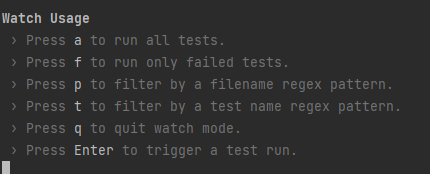
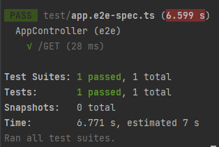
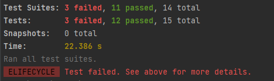
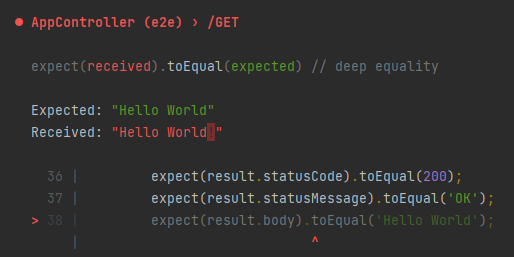

# Testing
In this document, we will describe important and good-to-know facts about the testing options. 
We will differ between "unit tests" and "End-to-End tests" (e2e). Unit tests focus on testing isolated single functions.
While e2e testing focus on the given input and expected result of the complete feature.
... more text coming ...

## Prerequisite

You need a personal environment file `.env.test` on the top level of your project. It can be a copy of your `.env` or
`.env.dev` file, but can also lead to a test database or contain test configurations. The path to test file is set in 
`test/dotenv-config.ts`.

## Installation

```bash
$ pnpm install
```

## Running the unit tests

Run all test cases in the project. Testcases are found by the `.spec.` file extension. 
```bash
$ pnpm test
```

Watches on changes of your testfiles and starts testing after saving. All uncommitted tests are launched.
After the initial test, a menu will appear with filter option. e.g: 
Press "p" and insert "general" to only watch and test testcases that contain the string "general".

```bash
$ pnpm test:watch
```
Testing menu: \


Testing success: \


Testing failure: \


Testing failure detail: \



## Running the e2e tests
e2e tests work similar to the unit tests. Testcases are found by the `.e2e-spec.` file extension. They are stored 
in the `test/` folder.

To run all tests:

```bash
$ pnpm test:e2e
```

To run and watch:

```bash
$ pnpm test:e2e:watch
```

## Examples

Basic examples for unit tests are in all modules and can be found with the `.spec.` file extension.
The most examples with comments are currently in `general.service.spec.ts`.
The e2e tests are saved in `test/` with the extension `.e2e-spec.`.

... more text and explanation ...

## Further reading

[NestJS testing docu](https://docs.nestjs.com/fundamentals/testing) \
[JEST docu](https://jestjs.io/docs/api) \
[Supertest docu](https://github.com/ladjs/supertest)

## Known Limitations
- Currently, only basic test cases
- Database operations with repositories are not supported
  - database response can be mocked or raw sql statements can be used

## Work In Progress
- implement more test cases
- Replace repository dependency for complete testing possibilities